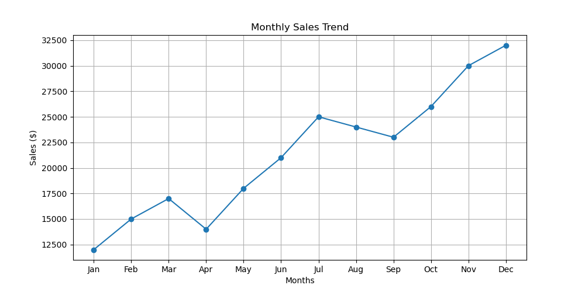
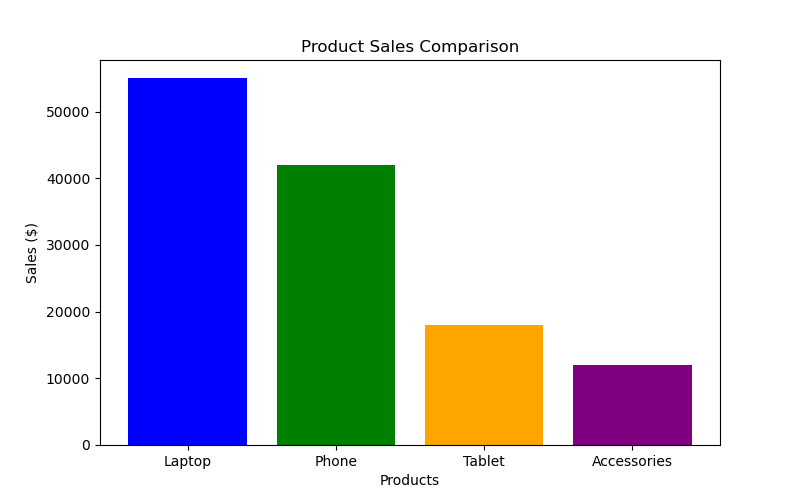
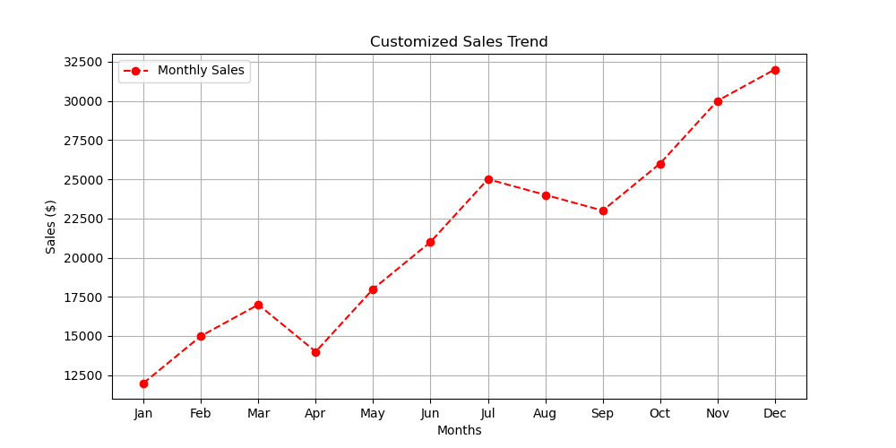
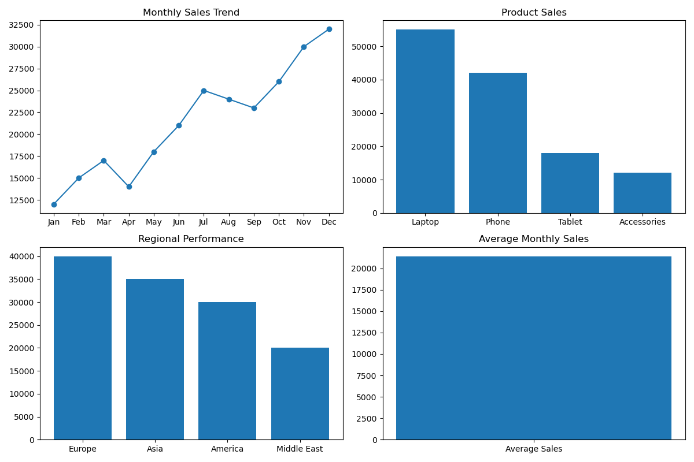

# İş Performansı Görselleştirme Dashboard'u 📊

Bu proje, bir şirketin yıllık satış verilerini analiz etmek ve görselleştirmek amacıyla Python ve Matplotlib kütüphanesi kullanılarak hazırlanmıştır.

## Grafik Analizleri

### 1. Aylık Satış Trendi
Satışların yıl içindeki değişimini gösteren genel bakış.

### 2. Ürün Bazlı Karşılaştırma
Hangi ürünün ne kadar kazandırdığını gösteren sütun grafiği.

### 3. Özelleştirilmiş Satış Analizi
Belirli trendleri vurgulayan stilize edilmiş grafik.

### 4. Satış Dashboard (Genel Özet)
Tüm verilerin tek bir ekranda toplandığı yönetici özeti.

## Kullanılan Teknolojiler
- **Python 3.x**
- **Matplotlib** (Görselleştirme)
- **NumPy** (Veri İşleme)
